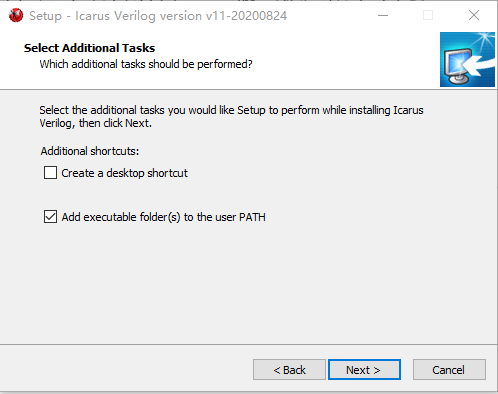
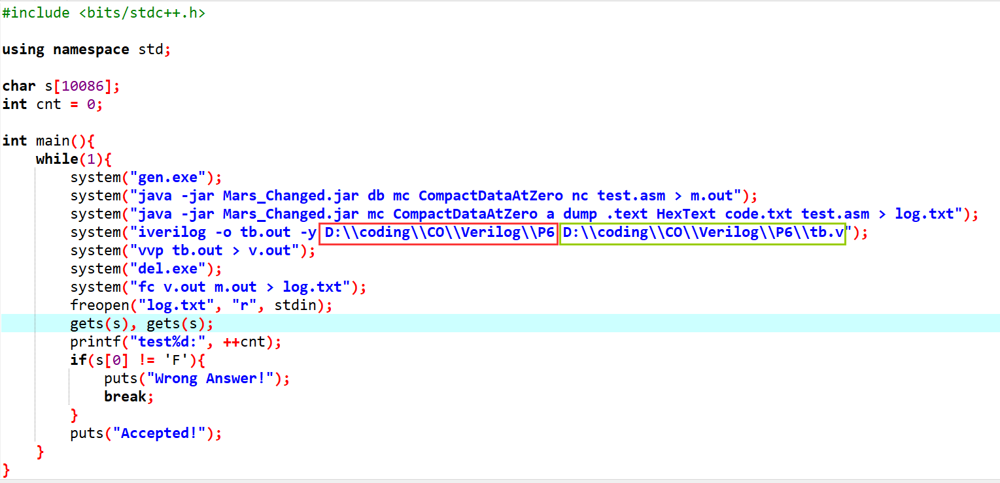
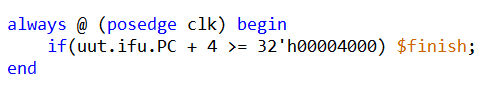

## 构造方案

- 除 0 号寄存器和 31 号寄存器外，每组数据最多出现 3 个不同的寄存器。
- DM 地址不超过 15。
- 跳转指令特殊构造，无死循环，如果跳转错误 CPU 输出极大概率不同。
- P6 对异常进行了规避。
- 基于以上规则随机生成 P5/P6 所有支持的指令。

## 使用方法

- 将 P5/P6 对应的压缩包解压缩到任意一个文件夹，双击 `iverilog-v11-20200824-x64_setup.exe` 安装 IVerilog，下图这一步**必须**勾选 `Add a executable folder(s) to the user PATH`。
  

- 打开 `run.cpp`，如下图所示，红框内改为 testbench 所在目录的绝对路径，绿框内改成 testbench 的绝对路径，记得反斜杠要**转义**！！
  
  另外，如果你使用了 `include`，需要将这一行额外加入下面黑色框内的部分，其中路径为 `include` 的文件所在目录的绝对路径。
  

- 编译 `run.cpp`，用 Dev-C++ 就可以。

- 小小修改一下 testbench，不然 IVerilog 会卡死，当 ifu 的 PC 超过 0x4000 时终止仿真，如下图所示：（其中 ifu 应改为你的 IFU 的实例化名称，PC 则是里面对应的 PC 接口名称，数据保证 PC 不超过 0x4000）

  

- CPU 要求和 P5/P6 课上要求完全相同。
- 点击 `run.bat`，跑上 $998244353$ 组。
- 程序会在第一个 `WA` 的点停下（和 codeforces 一样（x）），此时打开 `test.asm` 可以看到对应的指令代码，打开 `v.out` 可以看到你的 CPU 输出，打开 `m.out` 可以看到 MARS 标准输出。

## 注意事项
- 12.09 更新了忽略写入 0 号寄存器的输入。
- IVerilog 和 ISE 行为并不完全一致，如果使用 IVerilog 进行测试尽量避免使用阻塞赋值，否则可能遇到 PC 错乱等离谱 bug。
- 仿真时子模块名需要和相应的 .v 文件命名相同。
- 如果卡死了有可能是 CPU 死循环导致 PC 没有自增至 0x4000。
- 12.09 更新了 P5 数据生成器，之前的版本误包含 `jalr` 和 `addi` 这两个课上要求外的指令。
- 12.24 补充：数据生成器中仅缺少 jal/jalr 写入 31 号寄存器的值在 ex/mem 级向前转发的情况，这个情况可以手动构造一下，就 jal/jalr 的延迟槽放用到 31 号寄存器的 R 型指令即可。
